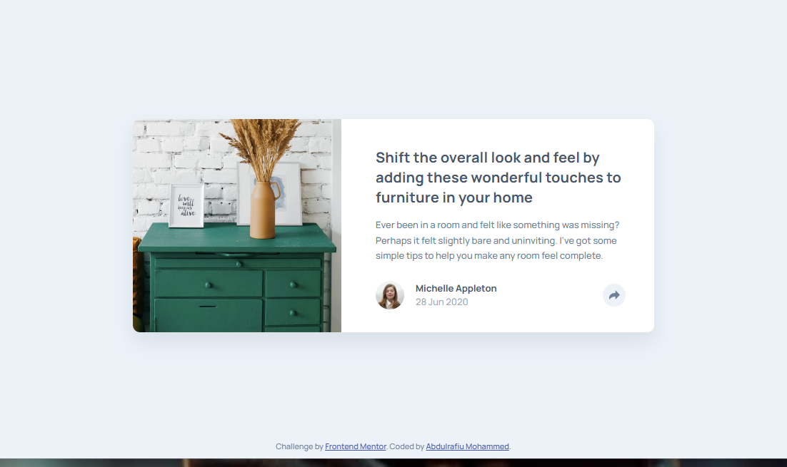

# Frontend Mentor - Article preview component solution

This is a solution to the [Article preview component challenge on Frontend Mentor](https://www.frontendmentor.io/challenges/article-preview-component-dYBN_pYFT). Frontend Mentor challenges help you improve your coding skills by building realistic projects. 

## Table of contents

- [Overview](#overview)
  - [The challenge](#the-challenge)
  - [Screenshot](preview.png)
  - [Links](#links)
  - [Built with](#built-with)
  - [What I learned](#what-i-learned)
  - [Continued development](#continued-development)
- [Author](#author)

## Overview

The application displays an article card containing an image, title, description, author information, and a share button. When the share button is activated, a share panel appears with social media options. The layout adapts seamlessly across desktop and mobile devices, providing an optimal user experience on different screen sizes.

### The challenge

Users should be able to:

- View the optimal layout for the component depending on their device's screen size
- See the social media share links when they click the share icon

### Screenshot

### Links

- Solution URL: [solution URL here](https://github.com/Rafman0/Article-preview-component)
- Live Site URL: [live site URL here](https://your-live-site-url.com)

### Built with

- HTML5
- CSS3
- JavaScript
- Flexbox
- CSS Grid
- Mobile-First Workflow

### What I learned

During this project, I practiced:

- Responsive web design techniques
- CSS positioning and layout management
- Flexbox and Grid layouts
- JavaScript event handling
- Component state management
- Building accessible and interactive user interfaces

### Continued development

Potential enhancements include:

- Adding animations to the share panel
- Supporting additional social media platforms
- Improving accessibility with enhanced keyboard navigation
- Adding share functionality using native browser APIs

## Author

- Youtube - [CodeWithMe](www.youtube.com/@Rafman01)
- Frontend Mentor - [@Rafman0](https://www.frontendmentor.io/profile/Rafman0)
- Twitter - [@Rafman010](https://x.com/rafman010?s=11)
- LinkedIn - [Abdulrafiu Mohammed](https://wwww.linkedin.com/in/abdulrafiu-mohammed-88176937a?utm_source=share_viautm_content=profile&utm_medium=member)
- Github - [Rafman0](https://github.com/Rafman0)

